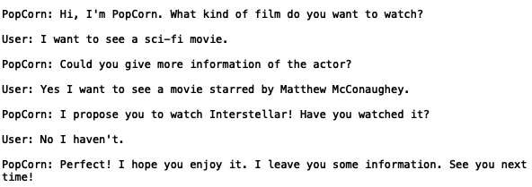
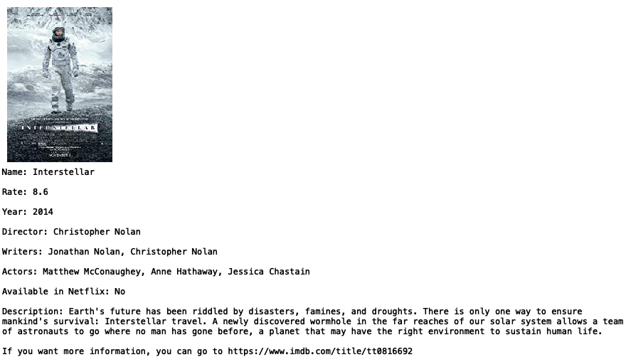

# PopCornAgent

###### _Authors: sgalella, mikirubio_

#### Description

Movie recommendation agent written in Python 3.6. Ask and finds the best film to recommend from an ontology including 30 different movies.

The search parameters are the following:
1. year
2. duration
3. country
4. genre
5. rate in IMDb
6. director
7. actor or actress

#### Images

Dialogue:
<p>
  
</p>

Information collected from IMDb:
<p align="center">
  
</p>


#### Installation

To install all the different dependencies of the project run. Make sure you are
working in a controllable environment (virtual environment, for example):
````
foo@bar:~$  pip install -r /path/to/requirements.txt
```
To run the agent, type:
```
foo@bar:~$  python run.py
```
